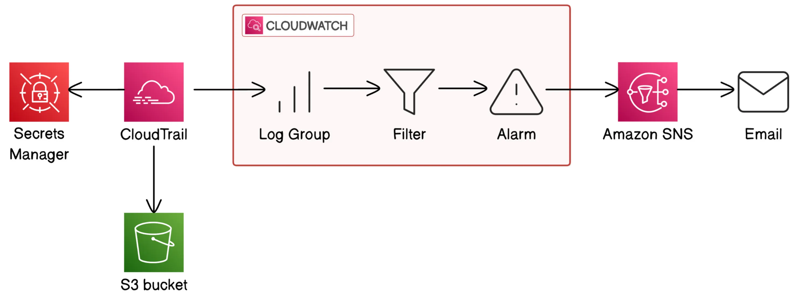

# Build a Security Monitoring System on AWS Using CloudTrail, CloudWatch, and SNS


This guide provides detailed steps on how to set up a security monitoring system using AWS services.

**Key Concepts:**

- **AWS Secrets Manager**
- **SNS (Simple Notification Service)**
- **CloudWatch**
- **CloudTrail**
- **S3 (Simple Storage Service)**
- **AWS CLI**

---

# Project Architecture



# Project Overview

In this project, we will demonstrate how to set up a robust monitoring system in AWS using CloudTrail, CloudWatch, and SNS (Simple Notification Service). Our goal is to build a fully functioning system that allows us to track security-related events and monitor access to sensitive data in AWS.

By working through this project, we aim to:

- Learn how AWS security and monitoring services work, including the integration of CloudTrail for tracking API activity, CloudWatch for log monitoring, and SNS for alerting.

- Set up an automated, real-time notification system that sends us alerts via email whenever a security event occurs.

- Understand the role of Secrets Manager in safeguarding sensitive information, and monitor access to such information to ensure it remains protected.

**this project will provide you with a working security monitoring system that can be used in production environments.**

### Step 1: Setting up Secrets Manager

**What is AWS Secrets Manager?**

AWS Secrets Manager helps you securely store and manage sensitive information like passwords, API keys, and credentials. Instead of keeping them in your code (which is risky) or sharing them through email, you can store them safely in Secrets Manager.

In this project, we're using a dummy secret, but in real life, you'd use it to store things like database passwords and API keys — information that could cause major security issues if exposed.

---

**What are we doing in this step?**

In this step, we will set up a secret in **AWS Secrets Manager**. This secret will be something we want to protect, and we will monitor access to this secret across the rest of the project.

---

#### Actions:

1. **Log into AWS Console:**
   - Start by logging into your AWS account and navigating to the **Secrets Manager** console.
2. **Create a New Secret:**

   - Click **Create secret** and configure the secret settings as per your security requirements.
   - For this example, we’ll use a simple secret for illustration purposes:
     ```json
     {
       "username": "my-username",
       "password": "my-password"
     }
     ```

3. **Choose Secret Type:**

   - Select **Other type of secret** and choose **Plaintext** as the secret type.
   - Enter the secret value as the JSON object (or use key-value pairs).

4. **Encryption Settings:**

   - The encryption key used for the secret is the **AWS managed key** (`aws/secretsmanager`), which is used for encrypting the secret value.

5. **Name the Secret:**

   - Give the secret a name (e.g., `MySampleSecret`) and proceed to the next step.

6. **Permissions and Replication:**

   - For now, leave the **resource permissions** and **replication settings** as default.
   - Click **Next** to proceed.

7. **Rotation Settings:**

   - **Rotation** helps to periodically change passwords or other sensitive credentials to improve security. For now, we are using dummy data, so we’ll leave **rotation settings disabled**.

   **Rotation Explanation:**

   - In real-life applications, you would set up **rotation** to automatically change secrets and prevent unauthorized access using outdated credentials. For now, we’re skipping this due to the use of dummy data.

8. **Store the Secret:**
   - After reviewing your settings, click **Next** and then click **Store** to create the secret.

---

### Step 2: Set Up and Configure CloudTrail

Now that we have our secret set up, the next step is configuring CloudTrail to monitor activities related to this secret and other resources in your AWS environment.

#### What is CloudTrail?

**CloudTrail** is a service that tracks and records user activity and API calls made across your AWS account.

It helps you monitor and log every action taken, such as who accessed what and when.

**For example, creating or deleting a secret, or when someone accesses it through Secrets Manager.** 😄

#### Actions:

1. **Go to CloudTrail Console:**
      - navigate to the **CloudTrail** console.
      - navigate to trails
      - Click on **Create trail**.
      - Choose a name for your trail and select the S3 bucket where you want to store the logs.
      - we disabled kms encryption for now
      - set rest of the settings to default
      - Log file validation in CloudTrail means checking whether a log file (which records AWS API activity) has been changed or tampered with after it was created.

            🔐 Simple Explanation:
            When enabled, CloudTrail log file validation creates a hash (like a digital fingerprint) for each log file and stores it in a separate "digest file". You can use this digest file to verify that 
            the log file hasn’t been changed, ensuring integrity and trustworthiness.
      - click **Next**.
      - choose **Event Type**
      - for now we will select **Management Events**
         - 🔧 **What are Management Events?**

           Management events are operations that modify AWS resources, including:
           - Creating or deleting services
           - Changing configurations 
           - Assigning permissions
           - Control plane operations (not data access)

           **Types of Actions Captured:**
           Management events include various API calls and actions:

           1. Creation and Deletion:
              - CreateBucket, DeleteBucket
              - RunInstances, TerminateInstances
              - Resource addition/removal events

           2. Configuration Changes:
              - Security group updates (AuthorizeSecurityGroupIngress)
              - IAM policy modifications (PutRolePolicy) 
              - VPC setting changes

           3. Service-Specific Operations:
              - RDS: CreateDBInstance
              - Lambda: CreateFunction
              - Other service configuration actions

           Each event captures:
           - Caller identity (user/service)
           - Source IP address
           - Timestamp
           - API call parameters
           - Request outcome (success/failure)
      - When setting up CloudTrail Management Events, you can choose to log:

            Read events — actions that view or list information

            Write events — actions that create, change, or delete something
      - **Exclusion List:** check to exclude aws kms events and RDS events      
      - click **Next**.
      - click **Create trail**

### Step 3: Verify CloudTrail
In this step, we will verify that our CloudTrail is working properly and confirm that CloudTrail logs are being generated when accessing a secret in Secrets Manager.

Run the following command in CloudShell or your terminal:
```bash
aws secretsmanager get-secret-value --secret-id <your-secret-name> --region your-region
```
### go to cloudtrail console and navigate to event history
  ### What is CloudTrail Event history?

   - Event history is where you can find all of your account’s management events from the last 90 days.

### Why use CloudTrail if we can just visit Event History?

CloudTrail offers more detailed logging and tracking than Event History. While Event History is useful for quick checks, CloudTrail provides long-term tracking not just for the last 90 days, including API calls and detailed logs in S3. This is important for auditing, security, and compliance.

#### make filtration to get only events related to secret manager
   - choose **Event Source** and search for **secrets manager.amazon.com**


---
### Step #4: Track Secrets Access Using CloudWatch Metrics

CloudTrail can track events for us, next up is to figure out how we can get alerts when your secret gets accessed.

We’ll start by sending all of CloudTrail's logs to CloudWatch. Once it’s in CloudWatch, we can set up helpful tools like CloudWatch metrics and alarms that can trigger notifications based on events.

---

**In this step, you're going to:**

- Enable CloudWatch Logs for your CloudTrail logs.
- Define a CloudWatch Metric to track secret access.

---

###  What is Amazon CloudWatch Logs and Why Is It Important for Monitoring?

Amazon CloudWatch Logs is a service that collects and centralizes logs from various AWS services, such as CloudTrail, to help with monitoring, troubleshooting, and gaining visibility into your infrastructure.

Once logs are stored in CloudWatch, you can:
- Monitor and analyze system activity.
- Create alarms based on specific log patterns (e.g., secret access).
- Trigger automated actions in response to events.

In our project, we’re sending CloudTrail logs to CloudWatch Logs so we can track when secrets are accessed and set up alerts accordingly.

---

### ⚙️ Actions: Enable CloudWatch Logs and Configure Monitoring

Follow these steps to enable CloudWatch Logs for CloudTrail and set up proper monitoring and alerts.

---

###  Step 1: Enable CloudWatch Logs in CloudTrail

1. open the **CloudTrail** service.
2. Choose the **trail** you want to modify was created.
3. Scroll to the **CloudWatch Logs** section.
4. **Check the "Enabled" box** to send logs to CloudWatch.
5. Choose or create a **new Log Group** (e.g., `/aws/cloudtrail/logs`).
6. Assign an **IAM role** that allows CloudTrail to publish logs to CloudWatch. You can create a new role or use an existing one. if use new role just put name of role but use the pattern found in box of name preffered not mendatory
7. Click **Save Changes**.

8. **navigate to cloudwatch console and go to ```log groups```**

9. go to the log group you created in cloudtrail and wait for logs to appear 

---

### ❓ Does CloudWatch retrieve logs directly from CloudTrail or from the S3 bucket created with the trail?

CloudWatch Logs does **not** retrieve logs from the S3 bucket created by CloudTrail.

Instead, when you **enable CloudWatch Logs integration** during the CloudTrail setup, **CloudTrail pushes log events directly to CloudWatch Logs in real time**.

The S3 bucket is still used as a storage destination for the full logs, but CloudWatch Logs receives a **stream of log events directly** from CloudTrail, independent of S3. This allows faster monitoring, filtering, and alerting capabilities without waiting for logs to be delivered to S3.

In summary:
- **CloudWatch Logs**: Receives log events directly from CloudTrail.
- **S3 Bucket**: Stores complete log files for archival or batch processing.


---

### 🧮 Step 2: Create a CloudWatch Metric to Track Secret Access

Now that logs are streaming into your CloudWatch Log Group, it’s time to create a **Metric Filter** to track when secrets are accessed.

#### 📌 Follow these steps:

1. Stay on your **CloudWatch Log Group** (used in the previous step).
2. At the top of the page, click **Actions** → **Create metric filter**.
3. In the **Filter pattern** field, enter:
This pattern matches log entries where someone retrieves the value of a secret using the `GetSecretValue` .

4. for now we ignore test patter and Click **Next** to move to the metric creation screen.

#### 📝 Define the metric details:

- **Filter name**: `TrackSecretAccess`
- **Metric namespace**: `SecurityMetrics`
- **Metric name**: `SecretAccessCount`
- **Metric value**: `1`  
- **Default value**: `0`

> **Metric value**: This is the value recorded when the filter finds a match in the logs. We use `1` to increment the count each time someone accesses a secret.
>
> **Default value**: This is what gets recorded when no match is found during a time period. Setting it to `0` ensures that empty time periods still show on charts — giving you a full picture of when access did or didn’t happen.

5. Review the configuration, then click **Create metric filter**.

---

### ❓ What Are CloudWatch Metric Filters?

CloudWatch **Metric Filters** scan your logs in real time and extract numerical data based on defined patterns. Instead of searching through logs manually, filters automatically track actions — like someone using `GetSecretValue` — and update metrics accordingly.

This filter will serve as the foundation for building alarms and dashboards to monitor secret access in a meaningful and automated way.

### Step 4: Create an Alarm to Monitor Secret Access and Set Up SNS Notifications Topic

Now that you have a metric to track, it’s time to create an **Alarm** to monitor when someone accesses a secret.

#### 📌 Follow these steps :

1. Stay on your **CloudWatch Log Group** (used in the previous step).
2. At the bottom of the page, click **metric filters** → **check the metric filter you created**.
3. Click **Create alarm**.

#### 📝 Define the alarm details:
4. In the **Statistic** field, select **Average**.
5. In the **Condition** field, select **Greater/Equal**.
6. In the **Threshold** value field, enter `1`.
7. Click **Next**.
8. in Notifications section, select **New Topic**.
9. Enter a name for the topic ,email and click **Create Topic**.
8. then Click **Next** and click **Create alarm**.
11. Accept Email Subscription.
---

## 🧪 Troubleshooting and Testing

If the alarm doesn't trigger after accessing the secret:
- Go back to the alarm settings.
- Change the **Statistic** from `Average` to `Sum`.
- Update the **Period** to `1 minute`.
- Save changes and re-test by retrieving the secret.

This should now trigger the alarm as expected.

---

## 🧹 Final Step: Clean Up Resources

To avoid unexpected charges, make sure to **delete all resources** you created during this setup.

### Resources to Delete:

- **CloudTrail Trail**
- **S3 Bucket** (used for CloudTrail logs)
- **CloudWatch Log Group**
- **CloudWatch Alarm**
- **Secrets Manager Secret**
- **SNS Topic and Subscription**


